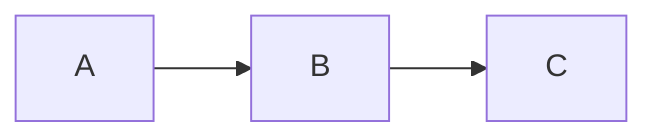

# Guia de Contribuição

Obrigado por contribuir com este repositório de manifestos em markdown!

## Como Contribuir

### 1. Escolha a Categoria Apropriada

- **projetos/**: Documentação de projetos específicos
- **arquitetura/**: Decisões arquiteturais e design de sistemas
- **prompts-ia/**: Prompts e guias para trabalhar com IA
- **diagramas/**: Diagramas técnicos e representações visuais

### 2. Use os Templates

Templates estão disponíveis em `templates/`. Copie o template apropriado e adapte-o às suas necessidades.

### 3. Convenções de Nomenclatura

- Use **kebab-case** para nomes de arquivos: `meu-documento.md`
- Inclua data quando relevante: `2026-01-06-nome-documento.md`
- Para ADRs, use numeração sequencial: `001-titulo-decisao.md`
- Use nomes descritivos e específicos

### 4. Estrutura do Documento

Cada documento deve incluir:

```markdown
# Título Claro e Descritivo

**Metadados relevantes** (Data, Autor, Status, etc.)

## Seções bem organizadas

Conteúdo claro e conciso...
```

### 5. Estilo de Escrita

- **Clareza**: Escreva de forma clara e direta
- **Concisão**: Seja objetivo, evite redundâncias
- **Estrutura**: Use headings para organizar o conteúdo
- **Exemplos**: Inclua exemplos quando apropriado
- **Links**: Referencie documentos relacionados

### 6. Markdown

Use markdown padrão (CommonMark):

- Headings: `#`, `##`, `###`
- Listas: `-` ou `1.`
- Código: ` ``` `
- Links: `[texto](url)`
- Imagens: ``
- Tabelas: Formato markdown padrão
- Diagramas: Mermaid quando possível

### 7. Diagramas

Prefira Mermaid para diagramas simples:



Para diagramas complexos:
- Use ferramentas externas (Draw.io, PlantUML)
- Exporte como PNG/SVG
- Inclua no repositório
- Link no documento

### 8. Versionamento

- Inclua seção de histórico no final do documento:

```markdown
## Histórico de Versões

| Data | Versão | Mudança | Autor |
|------|--------|---------|-------|
| YYYY-MM-DD | 1.0 | Criação inicial | Nome |
```

### 9. Revisão

Antes de submeter:

1. ✓ Leia o documento do início ao fim
2. ✓ Verifique links e referências
3. ✓ Teste diagramas Mermaid
4. ✓ Corrija ortografia e gramática
5. ✓ Valide formatação markdown

### 10. Pull Request

Ao criar um PR:

- Use título descritivo
- Descreva o que está adicionando/modificando
- Mencione documentos relacionados
- Adicione contexto se necessário

## Tipos de Contribuição

### Novos Documentos

1. Escolha a categoria apropriada
2. Use o template correspondente
3. Preencha todas as seções relevantes
4. Adicione à estrutura de pastas adequada

### Atualizações

1. Mantenha a estrutura existente
2. Atualize a seção de histórico
3. Verifique links para outros documentos
4. Mantenha compatibilidade com referências externas

### Correções

1. Pequenas correções podem ser diretas
2. Para mudanças significativas, discuta primeiro
3. Atualize histórico mesmo para correções

### Novos Templates

1. Coloque em `templates/`
2. Documente no README da pasta
3. Inclua exemplo de uso
4. Considere casos de uso diversos

## O Que Evitar

- ❌ Documentos muito longos (divida em múltiplos arquivos)
- ❌ Informações sensíveis ou proprietárias
- ❌ Conteúdo não relacionado às categorias
- ❌ Arquivos binários desnecessários
- ❌ Duplicação de conteúdo existente
- ❌ Links quebrados ou referências inválidas

## Organização de Pastas

Para projetos complexos, organize assim:

```
categoria/
├── nome-do-topico/
│   ├── README.md
│   ├── documento-1.md
│   ├── documento-2.md
│   └── assets/
│       └── imagem.png
└── README.md
```

## Dúvidas?

- Consulte os exemplos existentes
- Verifique os templates
- Leia os READMEs de cada categoria

## Código de Conduta

- Seja respeitoso e profissional
- Aceite feedback construtivo
- Colabore de forma positiva
- Foque na qualidade da documentação

---

Obrigado por contribuir! 🎉
