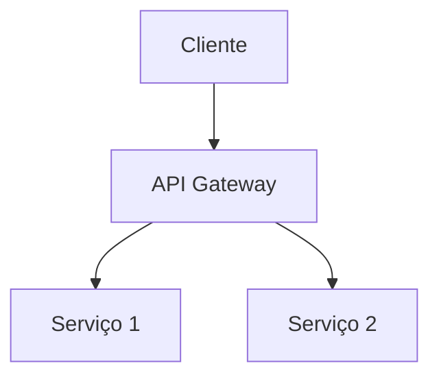
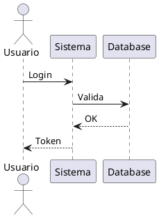

# Diagramas

Esta pasta contém diagramas técnicos e representações visuais.

## Conteúdo

Aqui você encontrará:

- **Diagramas de Fluxo**: Fluxos de processos e workflows
- **Diagramas de Sequência**: Interações entre componentes
- **Diagramas de Componentes**: Estrutura de componentes do sistema
- **Diagramas C4**: Contexto, Containers, Componentes e Código
- **Diagramas de Dados**: ERDs e modelos de dados
- **Diagramas de Infraestrutura**: Arquitetura de deployment

## Estrutura Sugerida

```
diagramas/
├── fluxo/
│   └── processo-de-compra.md
├── sequencia/
│   └── autenticacao-usuario.md
├── componentes/
│   └── arquitetura-microsservicos.md
├── c4/
│   ├── contexto.md
│   ├── containers.md
│   └── componentes.md
└── README.md
```

## Ferramentas para Diagramas

### Mermaid (Recomendado)

Mermaid permite criar diagramas em markdown:



Tipos suportados:
- Flowchart
- Sequence Diagram
- Class Diagram
- State Diagram
- Entity Relationship Diagram
- Gantt Chart

### PlantUML

Alternativa para diagramas mais complexos:



## Como Criar um Novo Diagrama

1. Escolha o tipo de diagrama apropriado
2. Use Mermaid para integração direta com markdown
3. Inclua descrição textual antes do diagrama
4. Adicione legendas e explicações após o diagrama
5. Mantenha diagramas simples e focados

## Melhores Práticas

- **Simplicidade**: Um conceito por diagrama
- **Clareza**: Nomes descritivos e legíveis
- **Consistência**: Use os mesmos símbolos e cores
- **Documentação**: Explique elementos não óbvios
- **Versionamento**: Mantenha histórico de mudanças importantes

## Recursos

- [Mermaid Documentation](https://mermaid.js.org/)
- [PlantUML Guide](https://plantuml.com/)
- [C4 Model](https://c4model.com/)
- [Diagrams.net](https://www.diagrams.net/)
