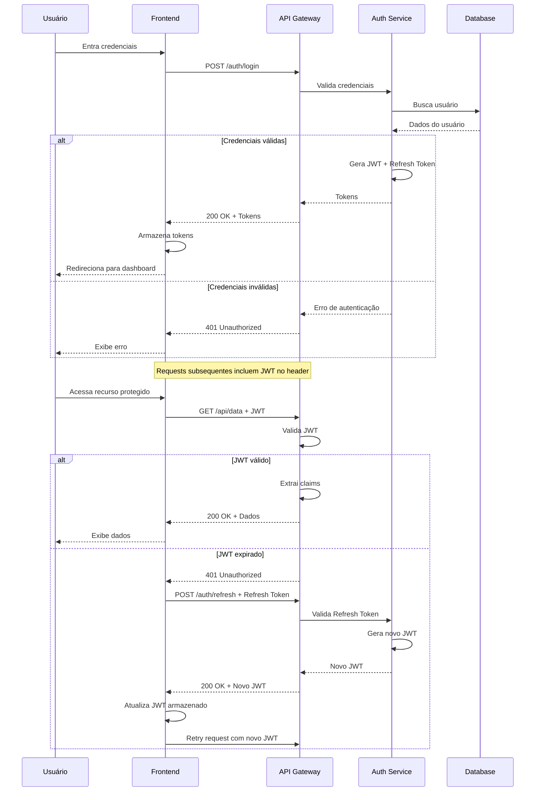

# Fluxo de Autenticação de Usuário

**Tipo**: Sequência  
**Criado em**: 2026-01-06  
**Última atualização**: 2026-01-06  
**Autor**: Equipe de Arquitetura

## Propósito

Representar o fluxo de autenticação de usuários usando JWT (JSON Web Tokens) em um sistema web moderno.

## Contexto

Este diagrama representa o fluxo de login de um usuário em uma aplicação web que utiliza:
- Frontend SPA (Single Page Application)
- API REST backend
- Autenticação baseada em JWT
- Refresh tokens para sessões de longa duração

## Diagrama

## Legenda

| Componente | Significado |
|------------|-------------|
| Usuário | Usuário final da aplicação |
| Frontend | Single Page Application (React/Vue/Angular) |
| API Gateway | Ponto de entrada da API |
| Auth Service | Serviço de autenticação e autorização |
| Database | Banco de dados de usuários |

## Descrição dos Componentes

### Frontend

- **Responsabilidade**: Interface do usuário, gerenciamento de tokens
- **Tecnologia**: React/Vue/Angular
- **Notas**: Armazena tokens em localStorage ou sessionStorage

### API Gateway

- **Responsabilidade**: Roteamento, validação inicial de JWT
- **Tecnologia**: Express/FastAPI/Spring Gateway
- **Notas**: Valida assinatura do JWT antes de rotear

### Auth Service

- **Responsabilidade**: Autenticação, geração e validação de tokens
- **Tecnologia**: Microserviço dedicado
- **Notas**: Único serviço com acesso direto à tabela de usuários

### Database

- **Responsabilidade**: Armazenamento de credenciais e dados de usuários
- **Tecnologia**: PostgreSQL/MongoDB
- **Notas**: Senhas hasheadas com bcrypt/argon2

## Fluxo Passo a Passo

1. **Login Inicial**: Usuário fornece email e senha
2. **Validação**: Auth Service verifica credenciais no banco de dados
3. **Geração de Tokens**: Se válido, gera JWT (curta duração) e Refresh Token (longa duração)
4. **Armazenamento**: Frontend armazena tokens localmente
5. **Acesso a Recursos**: Cada request inclui JWT no header Authorization
6. **Validação JWT**: API Gateway valida assinatura e expiração
7. **Refresh**: Quando JWT expira, usa Refresh Token para obter novo JWT
8. **Logout**: Invalida Refresh Token no servidor

## Cenários Alternativos

### Cenário 1: Login com MFA (Multi-Factor Authentication)

Após validação de credenciais, sistema envia código 2FA e aguarda confirmação antes de gerar tokens.

### Cenário 2: OAuth2/Social Login

Usuário autentica via Google/GitHub, sistema recebe token OAuth, valida com provider externo e gera tokens internos.

## Decisões de Design

- **JWT vs Session**: Escolhemos JWT para escalabilidade stateless
- **Refresh Token**: Implementado para balancear segurança (JWT curto) e UX (não fazer login frequente)
- **Armazenamento de Tokens**: localStorage permite persistência entre sessões

## Dependências

- Biblioteca JWT (jsonwebtoken, pyjwt)
- HTTPS obrigatório para segurança de tokens
- Database com índices em email/username

## Considerações

### Performance

- Validação de JWT é rápida (verificação de assinatura local)
- Não requer consulta ao banco para cada request
- Refresh token requer consulta ao DB apenas na renovação

### Segurança

- JWT tem tempo de expiração curto (15 minutos)
- Refresh token armazenado com hash no DB
- HTTPS obrigatório para transmissão de tokens
- Tokens incluem apenas claims necessárias (não dados sensíveis)

### Escalabilidade

- Stateless permite horizontal scaling
- Sem necessidade de sessões compartilhadas
- Cache de chave pública JWT para validação rápida

## Diagramas Relacionados

- [Arquitetura de Microsserviços](../arquitetura/microservices-architecture.md)
- [Fluxo de Autorização RBAC](authorization-flow.md)

## Referências

- [JWT RFC 7519](https://tools.ietf.org/html/rfc7519)
- [OWASP Authentication Cheat Sheet](https://cheatsheetseries.owasp.org/cheatsheets/Authentication_Cheat_Sheet.html)
- [ADR: Escolha de JWT](../arquitetura/002-jwt-authentication.md)

## Notas Adicionais

Para ambientes de alta segurança, considere implementar:
- Rotation de Refresh Tokens
- Token binding
- Anomaly detection em padrões de autenticação

---

## Histórico de Versões

| Data | Versão | Mudança | Autor |
|------|--------|---------|-------|
| 2026-01-06 | 1.0 | Criação inicial | Equipe de Arquitetura |
