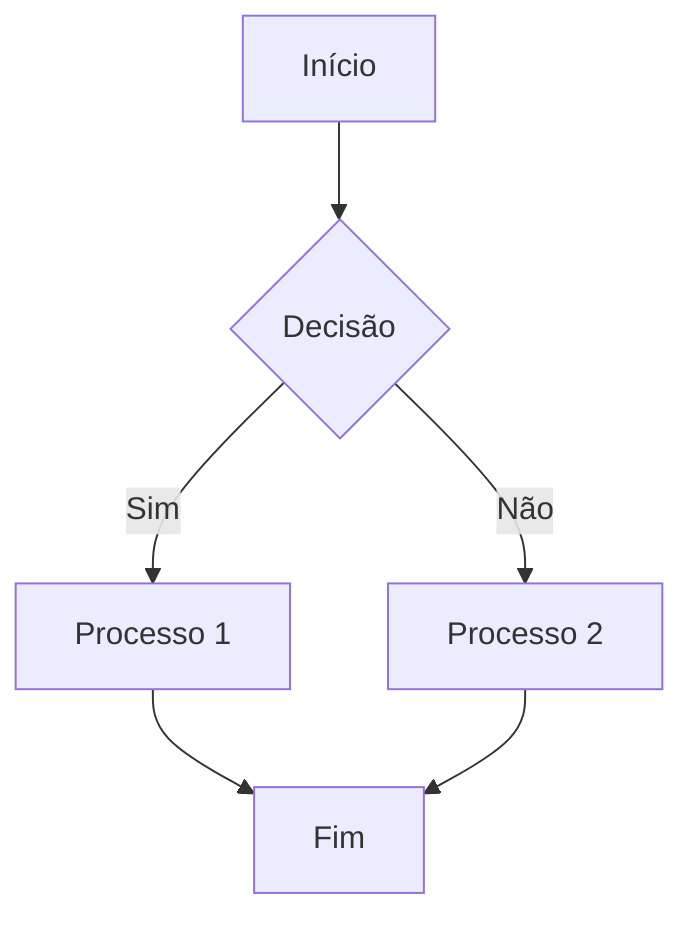

# [Título do Diagrama]

**Tipo**: [Fluxo | Sequência | Componentes | C4 | Dados | Infraestrutura]  
**Criado em**: YYYY-MM-DD  
**Última atualização**: YYYY-MM-DD  
**Autor**: [Nome]

## Propósito

Descreva o propósito deste diagrama e o que ele representa.

## Contexto

Forneça o contexto necessário para entender o diagrama:
- Quando este cenário ocorre
- Quais são os principais atores/componentes
- Qual problema ou fluxo está sendo representado

## Diagrama

## Legenda

| Símbolo/Cor | Significado |
|-------------|-------------|
| Retângulo | Processo |
| Losango | Decisão |
| Azul | Sistema interno |
| Verde | Sistema externo |

## Descrição dos Componentes

### Componente A: [Nome]

- **Responsabilidade**: O que faz
- **Tecnologia**: Se aplicável
- **Notas**: Informações adicionais

### Componente B: [Nome]

- **Responsabilidade**: O que faz
- **Tecnologia**: Se aplicável
- **Notas**: Informações adicionais

## Fluxo Passo a Passo

1. **Passo 1**: Descrição detalhada do que acontece
2. **Passo 2**: Descrição detalhada
3. **Passo 3**: Descrição detalhada

## Cenários Alternativos

### Cenário 1: [Nome]

Descrição de um fluxo alternativo ou caso de exceção.

### Cenário 2: [Nome]

Descrição de outro fluxo alternativo.

## Decisões de Design

- **Decisão 1**: Por que foi feito dessa forma
- **Decisão 2**: Justificativa da abordagem

## Dependências

- Dependência 1: Como afeta o diagrama
- Dependência 2: Como afeta o diagrama

## Considerações

### Performance

Aspectos de performance relevantes ao diagrama.

### Segurança

Considerações de segurança importantes.

### Escalabilidade

Como o design escala.

## Diagramas Relacionados

- [Diagrama Relacionado 1](link) - Como se relaciona
- [Diagrama Relacionado 2](link) - Como se relaciona

## Referências

- [ADR relacionado](link)
- [Documentação externa](URL)

## Notas Adicionais

Informações complementares ou observações importantes.

---

## Histórico de Versões

| Data | Versão | Mudança | Autor |
|------|--------|---------|-------|
| YYYY-MM-DD | 1.0 | Criação inicial | Nome |
